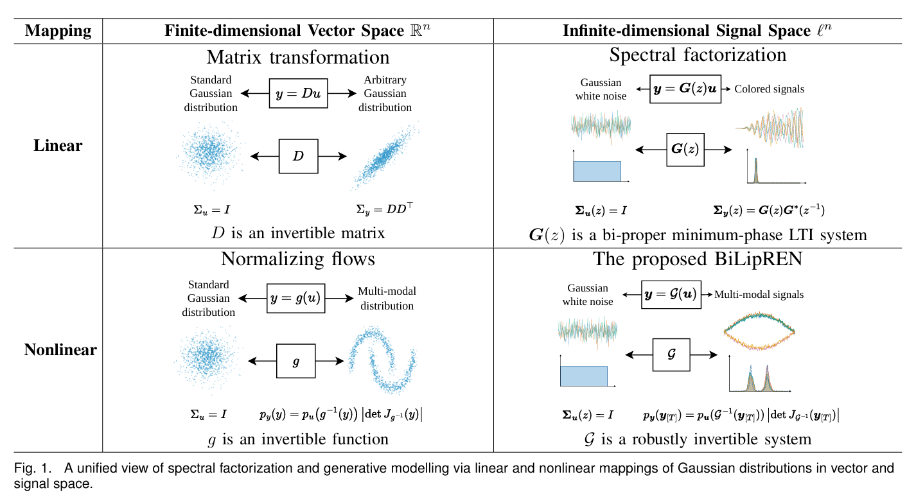
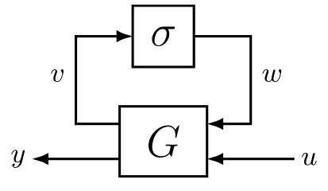
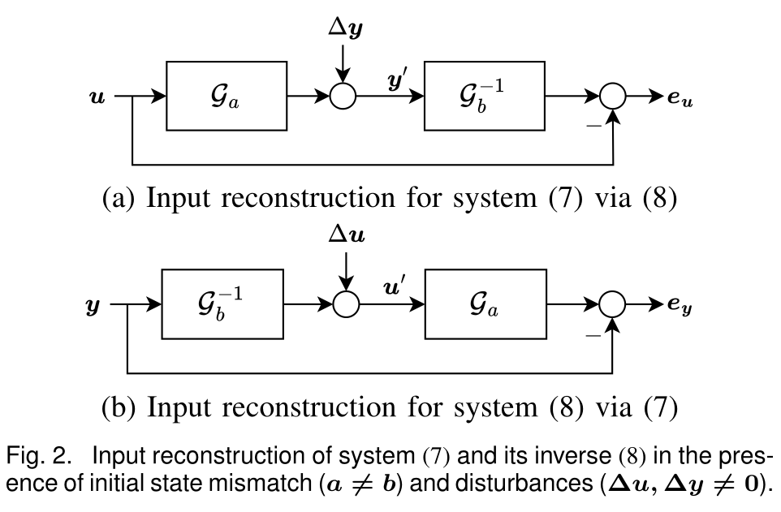
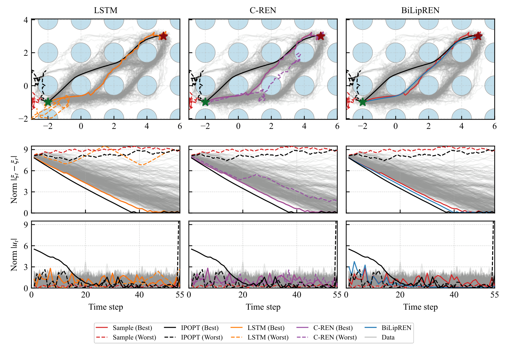
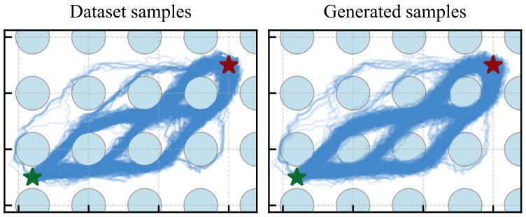
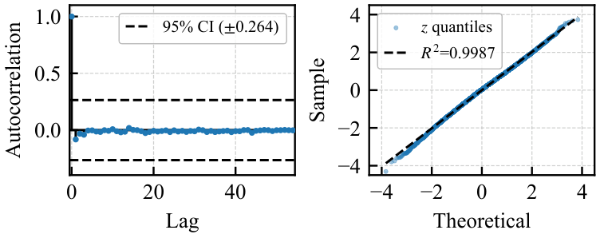
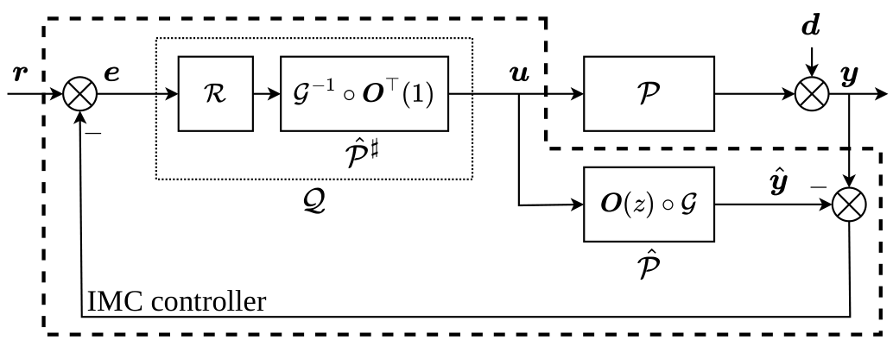
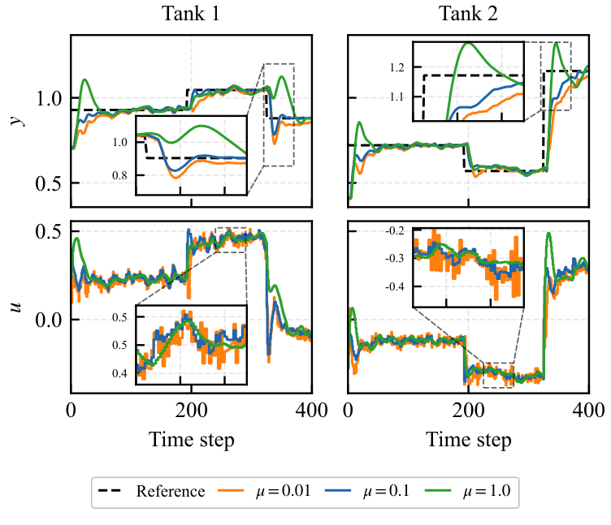

# Bi-Lipschitz Recurrent Equilibrium Network (BiLipREN)

> 📄 [arXiv:2607.10026](https://arxiv.org/abs/2607.10026): **Robustly Invertible Nonlinear Dynamics and the BiLipREN: From Inversion-Based Control to Generative Trajectory Modelling** 

## TL;DR

BiLipREN is a neural dynamical system that defines a robustly invertible signal-to-signal mapping.



The REN architecture $\mathcal{G}$ is a feedback interconnection between a learnable LTI system $\bm{G}$ and a fixed nonlinear activation $\sigma$.

<p align="center"></p>

The following properties are guaranteed *by construction* (plug-and-play with AutoDiff and SGD): 

1. The forward model $y=\mathcal{G}(u)$ is an invertible, stable and bi-Lipschitz REN.

2. Its analytical inverse $u=\mathcal{G}^{-1}(y)$ is  a causal, stable and bi-Lipschitz REN.


3. Both models enable robust signal reconstruction under disturbances and initial-state mismatch:

$$
\begin{split}
\|e_u\|_T \leq \lambda_{xu} |a-b| + \lambda_{yu}\|\Delta y\|_T \\
\|e_y\|_T \leq \lambda_{xy} |a-b| + \lambda_{uy}\|\Delta u\|_T
\end{split}
$$

<p align="center"></p>

## Applications

### 1. Optimization-Aware Dynamic Surrogate Loss 

**TD;LR:** *Learn an optimization-friendly surrogate loss for black-box trajectory optimization*

**Black-box Trajectory Optimization.** Suppose that $f,a, x_t, c_t, c_f$ are unknown, and only a dataset $\mathcal{D}=\{(u_{[0:T]}^i, J^i):1\leq i\leq n\}$ is available:
$$
\begin{split}
\min_{u_{[0:T]}\in\ell^m}\quad
&J\left(u_{[0:T]}\right)
:=
c_f(x_{T+1})+\sum_{t=0}^{T}c_t(x_t,u_t)\\
\mathrm{s.t.}\quad
&x_{t+1}=f(x_t,u_t), \quad x_0=a
\end{split}
$$
**Can we find a new input sequence $u_{[0:T]}$ is likely to achieve a lower cost than any sample in the dataset?**

- **Surrogate optimization framework:**

1. Fit a differentiable surrogate loss to the dataset:
$$
\hat{J}=\frac{1}{2}\|\mathcal{G}(u_{[0:T]})\|^2+c
$$
where $\mathcal{G}$ is a neural dynamical model that captures temporal structure and $c\in\mathbb{R}$ is a learnable parameter. 

2. Optimize the surrogate loss: 
$$
\hat{u}_{[0:T]}^\star:=\argmin_{u_{[0:T]}\in \ell^m}\; \hat{J} \left(u_{[0:T]}\right)
$$


- **Our approach**: parameterize $\mathcal{G}$ as a BiLipREN, giving the surrogate $\hat{J}$ two nice properties:

1. It satisfies the Polyak–Łojasiewicz (PL) condition. Consequently, despite being nonconvex, it has no spurious local minima, and gradient-based methods converge linearly under standard step-size conditions.
2. The minimizer can be computed efficiently through dynamic inversion: 
$$
\hat{u}_{[0:T]}^\star=\mathcal{G}^{-1}(0).
$$

- **Results:**

| Model | Fitting Loss $L$ | Best cost $J$ | Worse cost $J$ |
| -------- | -------- | -------- | -------- |
| Dataset | - | 1863 | 5055 |
| LSTM | 1718 | 1868 | 4758 |
| C-REN | 6014 | 1918 | 2996 |
| BiLipREN | 22805 | 1672 | - |
| IPOPT | - | 1618 | 5837 |

1.  The *LSTM* fits the dataset well but is less suitable for the subsequent optimization step because its loss landscape may contain spurious local minima, flat regions, poorly conditioned gradients, and strong sensitivity to initialization.

2. The *C-REN*, which is stable but not necessarily invertible, encounters similar difficulties.

3. The *BiLipREN* has a higher fitting loss but yields a lower optimized cost and a more tractable optimization landscape.

4. Even when *IPOPT* is applied to the true optimization problem, poor initial guesses can produce poor solutions because the problem is highly nonconvex.

<p align="center"></p>

### 2. Signal-to-Signal Nomralizing Flow

**TL;DR:** *Learn a signal-2-signal normalizing flow that generates trajectory distributions from Gaussian white noise*

**Generative trajectory modelling.** We seek a robustly invertible dynamical model $\mathcal{G}$ that generates samples matching the data distribution:
$$
y_{[0:T]} = \mathcal{G}\big(u_{[0:T]}\big), \quad u_t \sim \mathcal{N}(0, I),
$$
The model is trained by minimizing the negative log-likelihood (NLL) under the normalizing-flow change-of-variables formula:
$$
\mathcal{L}_{\mathrm{NLL}} = -\sum_{t=0}^{T}\left( \log p_u(u_t) + \log\left|\det\frac{\partial u_t}{\partial y_t}\right| \right).
$$

- **Results:**

1. The generated trajectories capture the multimodal, obstacle-avoiding distribution of the training data.

<p align="center"></p>

2. Mapping the data through $\mathcal{G}^{-1}$ produces approximately white Gaussian latent variables: their autocorrelations remain within the 95% confidence band, and their Q–Q plot closely follows that of a standard Gaussian distribution.

<p align="center"></p>

### 3. Inversion-based Control Design

**TL;DR:** *Design a tracking controller for a stable, nonminimum-phase plant.*

**Internal model control (IMC).** We learn an inner–outer factorization of the plant and invert only its minimum-phase outer factor, thereby obtaining a stable controller.

<p align="center"></p>

  1. Learn an inner–outer factorization from input–output data generated by the true system $\mathcal{P}$:
  $$
  \hat{\mathcal{P}} = \boldsymbol{O}(z)\circ\mathcal{G}
  $$
  where the inner factor $\boldsymbol{O}(z)$ is an all-pass filter (stable but non-minimum-phase system) and the outer factor $\mathcal{G}$ is a BiLipREN (stable minimum-phase system). 
  
  2. Construct the IMC controller in the Youla form with $Q$-parameter of
  $$
  \mathcal{Q} = \mathcal{R}\circ\hat{\mathcal{P}}^{\sharp}
  $$
  where $\mathcal{R}$ is a low-pass filter and $\hat{\mathcal{P}}^{\sharp} = \mathcal{G}^{-1}\circ\boldsymbol{O}^{\top}(1)$ is an approximate inverse of $\hat{\mathcal{P}}$. When the input is piece-wise constant signals, we have that $e_u=\hat{\mathcal{P}}\circ\hat{\mathcal{P}}^{\sharp}(u)-u$  converges exponentially to zero.


- **Results.** The controller achieves reference tracking for a four-tank system with delayed input flow. 

<p align="center"></p>

## Get started

```bash
git clone https://github.com/acfr/BiLipREN.git
cd BiLipREN
python3 -m venv .venv
source .venv/bin/activate
python -m pip install --upgrade pip
pip install -r requirements.txt
```

## Repository layout

| Folder | Description |
| --- | --- |
| `BiLipRENs/` | Core: BiLipREN models and orthogonal layers |
| `surrogate_cost/` | Application 1 — dynamic surrogate loss learning. |
| `flow/` | Application 2 — signal-to-signal normalizing flow. |
| `imc/` | Application 3 — inversion-based control design. |
| `io_fact/` | Example: nonlinear I/O factorization. |
| `robust_inv/` | Example: robust inversion |

## Contacts

Yurui Zhang (*yurui.zhang@sydney.edu.au*); 
Ruigang Wang (*ruigang.wang@sydney.edu.au*)
