# Bi-Lipschitz Recurrent Equilibrium Network (BiLipREN)

> 📄 [arXiv:2607.10026](https://arxiv.org/abs/2607.10026): **Robustly Invertible Nonlinear Dynamics and the BiLipREN: From Inversion-Based Control to Generative Trajectory Modelling** 

## TL;DR

BiLipREN is a neural dynamical system that defines a robustly invertible signal-to-signal mapping.


The REN architecture <picture><source media="(prefers-color-scheme: dark)" srcset="figures/eq/inline/G_dark.png"></picture> is a feedback interconnection between a learnable LTI system <picture><source media="(prefers-color-scheme: dark)" srcset="figures/eq/inline/bold_G_dark.png"></picture> and a fixed nonlinear activation <picture><source media="(prefers-color-scheme: dark)" srcset="figures/eq/inline/sigma_dark.png"></picture>.

<p align="center"></p>

The following properties are guaranteed *by construction* (plug-and-play with AutoDiff and SGD): 

1. The forward model <picture><source media="(prefers-color-scheme: dark)" srcset="figures/eq/inline/forward_dark.png">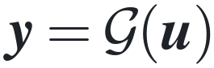</picture> is an invertible, stable and bi-Lipschitz REN.

2. Its analytical inverse <picture><source media="(prefers-color-scheme: dark)" srcset="figures/eq/inline/inverse_dark.png">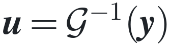</picture> is a causal, stable and bi-Lipschitz REN.


3. Both models enable robust signal reconstruction under disturbances and initial-state mismatch:

<p align="center">
  <picture>
    <source media="(prefers-color-scheme: dark)" srcset="figures/eq/eq_reconstruction_dark.png">
    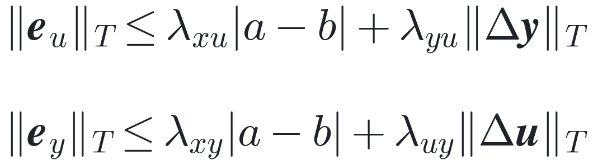
  </picture>
</p>

<p align="center"></p>

## Applications

### 1. Optimization-Aware Dynamic Surrogate Loss 

**TD;LR:** *Learn an optimization-friendly surrogate loss for black-box trajectory optimization*

**Black-box Trajectory Optimization.** Suppose that <picture><source media="(prefers-color-scheme: dark)" srcset="figures/eq/inline/unknowns_dark.png">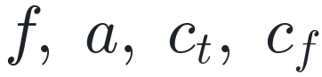</picture> are unknown, and only a dataset <picture><source media="(prefers-color-scheme: dark)" srcset="figures/eq/inline/dataset_dark.png">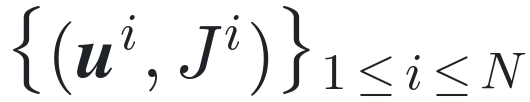</picture> is available:

<p align="center">
  <picture>
    <source media="(prefers-color-scheme: dark)" srcset="figures/eq/eq_problem_dark.png">
    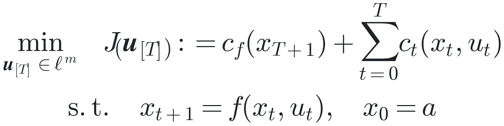
  </picture>
</p>

**Can we find a new input sequence <picture><source media="(prefers-color-scheme: dark)" srcset="figures/eq/inline/u_T_dark.png">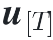</picture> that is likely to achieve a lower cost than any sample in the dataset?**

- **Surrogate optimization framework:**

1. Fit a differentiable surrogate loss to the dataset:
   
<p align="center">
  <picture>
    <source media="(prefers-color-scheme: dark)" srcset="figures/eq/eq_surrogate_dark.png">
    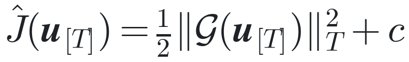
  </picture>
</p>

where <picture><source media="(prefers-color-scheme: dark)" srcset="figures/eq/inline/G_dark.png"></picture> is a neural dynamical model that captures temporal structure and <picture><source media="(prefers-color-scheme: dark)" srcset="figures/eq/inline/c_real_dark.png"></picture> is a learnable parameter. 

2. Optimize the surrogate loss:
   
<p align="center">
  <picture>
    <source media="(prefers-color-scheme: dark)" srcset="figures/eq/eq_argmin_dark.png">
    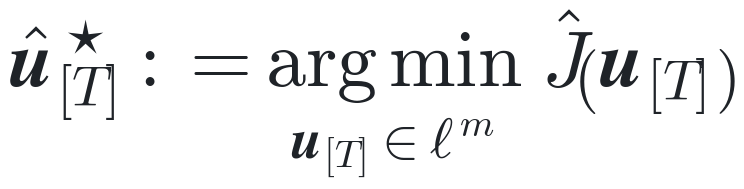
  </picture>
</p>


- **Our approach**: parameterize <picture><source media="(prefers-color-scheme: dark)" srcset="figures/eq/inline/G_dark.png"></picture> as a BiLipREN, giving the surrogate <picture><source media="(prefers-color-scheme: dark)" srcset="figures/eq/inline/J_hat_dark.png"></picture> two nice properties:

1. It satisfies the Polyak–Łojasiewicz (PL) condition. Consequently, despite being nonconvex, it has no spurious local minima, and gradient-based methods converge linearly under standard step-size conditions.
2. The minimizer can be computed efficiently through dynamic inversion:
   
<p align="center">
  <picture>
    <source media="(prefers-color-scheme: dark)" srcset="figures/eq/eq_inversion_dark.png">
    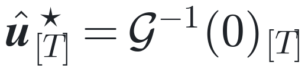
  </picture>
</p>

- **Results:**

<div align="center">
   
| Model | Fitting loss $L$ | Best cost $J$ | Worst cost $J$ |
| -------- | -------- | -------- | -------- |
| Dataset | - | 1863 | 5055 |
| LSTM | 1718 | 1868 | 4758 |
| C-REN | 6014 | 1918 | 2996 |
| BiLipREN | 22805 | 1672 | - |
| IPOPT | - | 1618 | 5837 |

</div>

1.  The *LSTM* fits the dataset well but is less suitable for the subsequent optimization step because its loss landscape may contain spurious local minima, flat regions, poorly conditioned gradients, and strong sensitivity to initialization.

2. The *C-REN*, which is stable but not necessarily invertible, encounters similar difficulties.

3. The *BiLipREN* has a higher fitting loss but yields a lower optimized cost and a more tractable optimization landscape.

4. Even when *IPOPT* is applied to the true optimization problem, poor initial guesses can produce poor solutions because the problem is highly nonconvex.

<p align="center"></p>

### 2. Signal-to-Signal Nomralizing Flow

**TL;DR:** *Learn a signal-2-signal normalizing flow that generates trajectory distributions from Gaussian white noise*

**Generative trajectory modelling.** We seek a robustly invertible dynamical model <picture><source media="(prefers-color-scheme: dark)" srcset="figures/eq/inline/G_dark.png"></picture> that generates samples matching the data distribution:

<p align="center">
  <picture>
    <source media="(prefers-color-scheme: dark)" srcset="figures/eq/eq_generation_dark.png">
    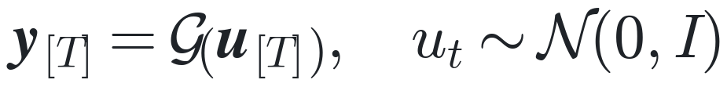
  </picture>
</p>

The model is trained by minimizing the negative log-likelihood (NLL) under the normalizing-flow change-of-variables formula:

<p align="center">
  <picture>
    <source media="(prefers-color-scheme: dark)" srcset="figures/eq/eq_nll_dark.png">
    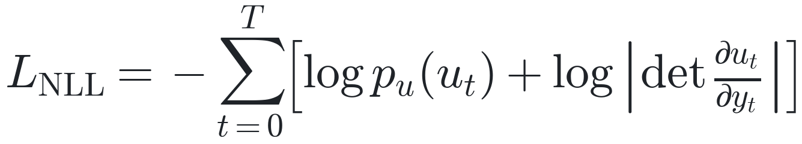
  </picture>
</p>

- **Results:**

1. The generated trajectories capture the multimodal, obstacle-avoiding distribution of the training data.

<p align="center"></p>

2. Mapping the data through <picture><source media="(prefers-color-scheme: dark)" srcset="figures/eq/inline/G_inverse_dark.png">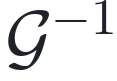</picture> produces approximately white Gaussian latent variables: their autocorrelations remain within the 95% confidence band, and their Q–Q plot closely follows that of a standard Gaussian distribution.

<p align="center"></p>

### 3. Inversion-based Control Design

**TL;DR:** *Design a tracking controller for a stable, nonminimum-phase plant.*

**Internal model control (IMC).** We learn an inner–outer factorization of the plant and invert only its minimum-phase outer factor, thereby obtaining a stable controller.

<p align="center"></p>

  1. Learn an inner–outer factorization from input–output data generated by the true system <picture><source media="(prefers-color-scheme: dark)" srcset="figures/eq/inline/P_dark.png"></picture>:
     
<p align="center">
  <picture>
    <source media="(prefers-color-scheme: dark)" srcset="figures/eq/eq_iofact_dark.png">
    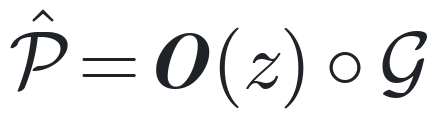
  </picture>
</p>
  
  where the inner factor <picture><source media="(prefers-color-scheme: dark)" srcset="figures/eq/inline/O_z_dark.png">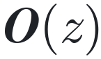</picture> is an all-pass filter (stable but non-minimum-phase system) and the outer factor <picture><source media="(prefers-color-scheme: dark)" srcset="figures/eq/inline/G_dark.png"></picture> is a BiLipREN (stable minimum-phase system). 
  
  2. Construct the IMC controller in the Youla form with <picture><source media="(prefers-color-scheme: dark)" srcset="figures/eq/inline/Q_dark.png"></picture>-parameter
     
<p align="center">
  <picture>
    <source media="(prefers-color-scheme: dark)" srcset="figures/eq/eq_Q_dark.png">
    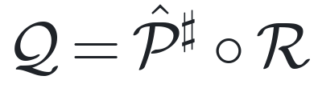
  </picture>
</p>
  
  where <picture><source media="(prefers-color-scheme: dark)" srcset="figures/eq/inline/R_dark.png"></picture> is a low-pass filter and <picture><source media="(prefers-color-scheme: dark)" srcset="figures/eq/inline/P_sharp_dark.png">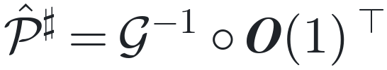</picture> is an approximate inverse of <picture><source media="(prefers-color-scheme: dark)" srcset="figures/eq/inline/P_hat_dark.png"></picture>. For piecewise-constant inputs, <picture><source media="(prefers-color-scheme: dark)" srcset="figures/eq/inline/e_u_dark.png">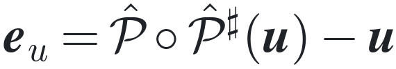</picture> converges exponentially to zero.


- **Results.** The controller achieves reference tracking for a four-tank system with delayed input flow. 

<p align="center"></p>

## Get started

```bash
git clone https://github.com/acfr/BiLipREN.git
cd BiLipREN
python3 -m venv .venv
source .venv/bin/activate
python -m pip install --upgrade pip
pip install -r requirements.txt
```

## Repository layout

| Folder | Description |
| --- | --- |
| `BiLipRENs/` | Core: BiLipREN models and orthogonal layers |
| `surrogate_cost/` | Application 1 — dynamic surrogate loss learning. |
| `flow/` | Application 2 — signal-to-signal normalizing flow. |
| `imc/` | Application 3 — inversion-based control design. |
| `io_fact/` | Example: nonlinear I/O factorization. |
| `robust_inv/` | Example: robust inversion |

## Contacts

Yurui Zhang (*yurui.zhang@sydney.edu.au*) 

Ruigang Wang (*ruigang.wang@sydney.edu.au*)
